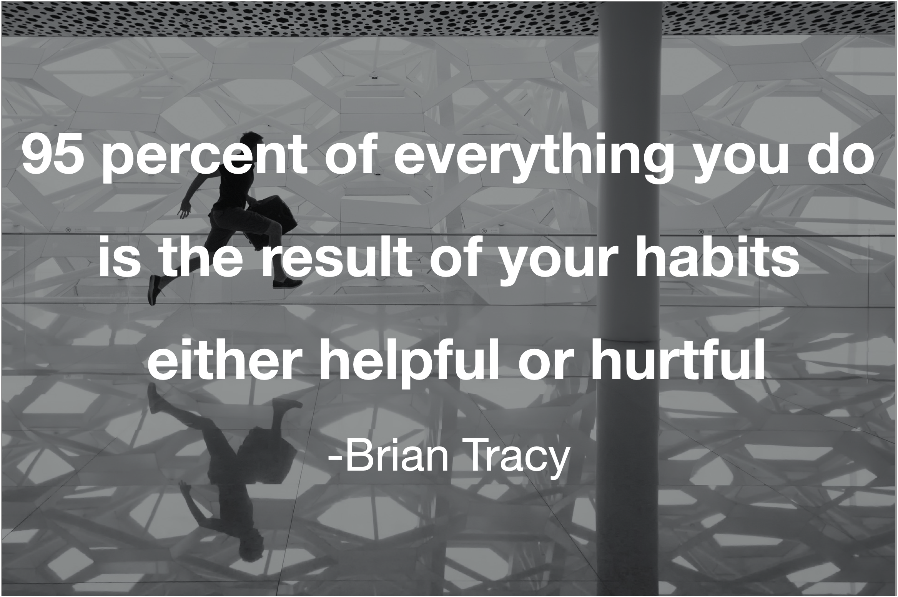

## 습관이 우리 인생을 만든다

인생을 망치는 것도, 성공시키는 것도 모두 습관의 산물이다. 일단 습관이 되어 버리면 두뇌의 별다른 저항 없이 그 일을 하게 된다. 나를 망치는 일을 스스럼없이 하게 되기도, 아주 생산적인 일을 별 어려움 없이 하게 되기도 한다. 그 일을 하는데 큰 저항이 느껴지지 않는다. 어떤 행동을 계속하고 그 행동의 결과가 우리의 인생을 바꾼다.

좋은 습관을 많이 가지고 있는 것이 꾸준한 성장의 비밀이다. 좋은 습관은 눈치채지 못하는 사이에 우리 인생에 좋은 것들을 적립해 준다.

나도 행복한 삶을 위해 좋은 습관을 많이 만들고 싶은 마음에 도전해 보았지만, 만들고자 한 모든 습관을 만든 것은 아니다. 그 이유에 대해서 생각해 보는 시간을 가져 보고자 한다.

## 습관 5개 중 2개가 정착했다

### 정착하지 못한 습관

**운동을 꾸준히 하고 싶었다.** 그래서 원펀맨 첼린지를 시작했다. 하루에 팔굽혀 펴기 100개를 하는 사람이 되었다. 하지만 딱 거기까지 였다. 그 이후로 이 첼린지를 이어나가지 못했다. 이 첼린지는 너무 힘들었다. 그래서 첼린지 목표를 달성하고 이어나고 싶은 마음이 들지 않았다. 몸이 좋아진 건 좋았지만, 근본적으로 내가 몸이 좋아지고자 하는 욕구가 별로 없어서 이어 나가지 못했다. 탁구를 계속 쳐서인지, 운동 루틴을 안 해도 체력이 떨어진다는 생각이 들지는 않는다. 그래서 안 하는 것 같다.

**개발 블로그 글을 하루에 하나씩 쓰고 싶었다.** 매일 공부한 것을 조금씩 남기며 학습의 효율을 극대화하고 싶었다. 한달 넘게 블로깅을 꾸준히 해 왔지만, 일이 바빠지니, 거의 엄두조차 못 내는 일이 되었다. 시간을 투자하지 않고 블로깅을 하면 학습에 큰 도움이 되지 않고, 열심히 쓰자니 너무 힘이 많이 들었다.

**꾸준히 개발 공부를 하고 싶었다.** 매일 조금이라도 미래의 나의 몸값을 올릴 수 있는 공부를 하고 싶었다. 하루에 몇십분 정도를 들여서 개발 공부를 하는 일은 분명 그렇게 어려운 일은 아니다. 하지만, 당장 안한다고 해서 큰 문제가 되지 않는다는 생각에 개발 공부를 거의 하지 않고 있다.

### 정착한 습관

**자기 전 매일 하루의 일을 반성한다.** 내 인생의 원칙을 어기고 살지는 않았는가? 오늘 더 잘할 수 있었던 일이 있었는가? 게으름 피우지는 않았는가? 이 세 가지 질문에 대한 답을 매일 자기 전에 기록한다. 오늘 회사에서 기술적으로 새로 배운 것이 무엇인지 기록한다. 반성의 결과는 바로 다음 날 회사에서 나타난다. 개선점을 바로 반영해 보고 더 나아진 나의 모습을 실시간으로 볼 기회가 많다. 회사에서 시간을 더 잘 쓰기 위해, 업무를 잘게 나누고 작은 데드라인을 두기로 했다. 그 후 처리해 낼 수 있는 일의 양이 늘어난 것을 느낀다. 이런 재미가 이 습관을 유지할 수 있도록 돕는다.

**매일 명상을 한다.** 아침에 일어나면, 요가와 명상으로 하루를 시작한다. 요가는 가끔 빼먹지만, 명상은 매일 하는 편이다. 명상은 들이는 노력에 비해서 얻는 게 확연히 크다. 아침에 15분 정도만 투자하면 된다. 훨씬 침착하게 하루를 살 수 있고 뚜렷하게 생각할 수 있다. 그래서 명상은 매일 한다.

## 즉각적 보상의 여부가 습관 형성의 성패를 결정했다

매일 지키는 습관과 그렇지 않은 습관을 비교해 보면 나의 성향이 분명하게 드러난다. 들이는 노력에 대한 즉각적 보상의 수준이 높아야 한다. 장기적인 보상은 나의 뇌가 직접적인 보상으로 생각하지 않는 듯하다. 장기적 보상을 위한 행동보다는 쉬어 버리는 것이 더 매력적으로 느껴져서 그냥 쉬어 버린다.

뇌가 장기적 보상을 더 직접적으로 느끼게 할 수 있는 방법이 필요하다. 습관 만들기를 키워드 삼아 유튜브를 돌아다녔다. 미국 자기개발의 클래식, 브라이언 트레이시가 습관을 만드는 방법에 대해서 이야기한 영상에서 한 이야기를 들어봤다.

습관을 잘 만들기 위한 7가지 팁을 배웠다. 정리하자면 아래와 같다.

---

- Clearly decide on a specific new habit

  - 구체적으로 어떤 습관을 할지 정의해야 한다. 그래야 할 수 있다.

- Never allow exception

  - 습관을 형성하는 도중에는 절대 예외를 허용해서는 안 된다.

- Let others know about your goal

  - 다른 사람들에게 목표에 대해 말함으로써 자신을 더 통제할 수 있게 된다.

- Visualize yourself behaving a particular way

  - 내가 특정 행동을 하는 것을 상상하면 나의 뇌는 그 행동을 더 친숙하게 느끼고 습관으로 행동이 형성되는 속도를 빠르게 해 준다.

- Create affirmation

  - 특정한 행동을 내가 할 것이라고, 스스로 이야기한다. 나는 매일 아침 7시에 일어나 운동하는 사람이다.

- Persist until it is automatic

  - 습관화되면 하는 것이 안 하는 것보다 더 자연스러워 진다. 그때까지 계속 의도적으로 행동해야 한다.

- Reward yourself
  - 행동에 대한 보상을 받으면 뇌에서 도파민이 분비되어 해당 행동을 뇌에서 더 빨리 습관으로 받아들이게 된다.

---

1번 3번은 이미 하는 것이고, 2번, 6번은 안다고 해서 뭔가를 할 수 있을 거 같지 않다. 그냥 열심히 하라는 말과 큰 차이가 없다.

4번, 5번, 7번에서 내가 더 개선할 수 있는 부분을 찾았다. 7번뿐만 아니라, 4번, 5번은 모두 보상과 관련이 있는 항목이다. 성공한 모습을 상상하는 것만으로 뇌는 도파민을 내뿜는다. 스스로 내가 잘 해낼 것이라고 확언하는 것도 자신감을 고취하고 즐거운 기분을 느끼게 한다. 적어도 나에게는 그렇게 작용한다. 예전에는 이런 상상과 언어의 힘을 잘 이용해서 자신을 동기부여하곤 했는데, 까맣게 잊어버리고 있었다.

나에게 보상을 주는 방식에 이를 참고한다면, 장기적 보상을 위한 습관도 지속해서 실천할 수 있지 않을까 생각한다.

## 메타 습관: 상상하기, 확언하기, 보상하기

습관을 만들기 위한 습관을 만들어 보자. 이를 메타 습관이라고 이름 붙이겠다. 습관을 멋지게 해내는 내 모습을 상상하고 스스로 확언을 한다. 실제 그 행동을 하면 보상을 한다. 습관을 위한 습관을 먼저 습관화해 보자

자기 전 내가 습관을 해내는 모습을 상상하고, 나는 내일 000을 한다고 스스로 10번씩 말하자. 습관으로 만들기로 한 행동을 실제로 하면, 내가 순수하게 좋아하는 일들을 해서 나에게 보상을 준다. 소설 읽기, 게임, 샤워, 간식, 산책, 스스로 소리 내어 칭찬 등 그때그때 내가 순수하게 기분이 좋아지는 일을 반드시 한다.

**메타 습관으로 만들어낼 습관은 아침 운동, 저녁 개인 공부로 하겠다. 다음 글에서는 메타 습관이 얼마나 성공적으로 습관을 만들어 냈는지에 대해 이야기를 해 보도록 하겠다.**
