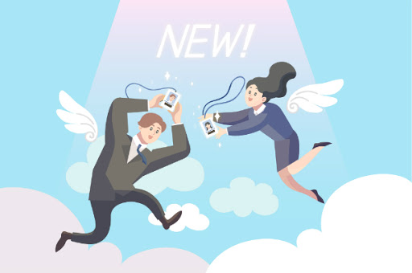

신입사원 연수 때의 일이다. 한 회사 선배는 동기들이 모인 자리에서 이렇게 말했다.

>“우리는 신입들에게 많은 것을 바라지 않습니다. 인사 잘 하시고, 늦지 마시고, 졸지 마세요.”

이 세 가지, 생각보다 어렵다. 이 글은 한 중고 신입의 **신입사원 3대 덕목** 성취 분투기이다.

## 인사 잘하기

**‘인사가 만사다’**라는 말이 있다. 물론 이 인사(HR)는 그 인사(Greeting)가 아니지만 신입사원들에게 인사의 중요성을 일깨우는 농담으로 쓰이는 말이기도 하다. 

신입으로 2개월 동안 인사를 오지게 박고 다녀본 입장에서 인사의 의미는 크게 두 가지가 있는 듯 하다. 우선 첫 번째로는 팀 멤버들에게 존재를 인지시키는 것이다. 인사를 통해 다양한 시그널을 보낼 수 있다. 예를 들면 ‘저 지각 안했습니다’, ‘오늘도 정장 입고 왔습니다’ 등의 소소한 메세지 등을 전할 수 있다. 일종의 커뮤니케이션인 것이다.

다음으로는 팀 선배들이 가지고 있는 권위의 확인이다. 과거 중세 프랑스의 기사들은 철투구를 쓰고 다녔기에 서로에 대한 구체적인 인지(누가 누군지)가 어려웠는데, 그래서 보통 자신보다 높아보이는 사람을 만나면 투구의 얼굴 가리개를 위로 밀어올리며 적의가 없다는 사실을 상대방에게 알렸다고 한다.

나는 사실 입사 후 선배들에게 인사를 잘 해야한다는 말이 군에서 입대 후 부사관/위관들에게 경례를 잘 해야한다는 말과 똑같이 들렸다.

어쨌든 신입은 기존의 멤버들로부터 일을 배워야하며, 배운 것을 토대로 선배들 협력하여 일을 처리해야 하는 입장이다. 그래서 그들에 지속적으로 인사하는 것을 통해 그들의 권위를 확인하고, ‘한 편’임을 지속적으로 상기시켜주는 것이다.

특히 재밌었던 건 인사의 중요성을 역설하던 선배는 ‘인사 잘하기’ 세부지침으로 최소 같은 층에서 근무하는 모든 사람들에게 열심히 인사를 하는 것이 좋을 것이라고 말했다. 이러한 조언을 가볍게 생각해보면, 나를 모르고 나랑 관계 없을 것 같은 사람에게도 굳이 인사를 해야하나 이런 생각이 들기도 했다.

하지만, 한국사회는 권위를 중심으로 돌아가는 사회이다. 국토의 면적이나 국민의 인종 구성, 소속집단 내의 사회적 거리를 생각해보면 사실 이 좁은 땅덩어리에선 몇 다리 건너면 다 아는 사람이다. 

이러한 조건 하에, 전통적인 관습을 가지고 있는 집단에서 빠르게 적응하는 가장 좋은 방법은 해당 집단의 권위를 인정하고 내가 할 수 있는 것들을 찾아서 나의 역할을 확보하는 것이라고 생각한다. 물론, 이 권위를 부정하고 비효율을 개선하려고 노력할 수도 있겠지만... 신입 혼자서는 못한다.  

팀 멤버들과의 커뮤니케이션 높이면? 좋다. 소속 집단에서 나의 역할을 찾는 것? 역시 좋다. 그럼 인사를 오지게 박아야하나? 답은 Yes!

## 늦지 않기

뭐든지 100%를 달성하는 것은 어렵다. 태어나서 한 번도 지각해보지 않은 사람이 있을까. 천재지변에서부터 지하철 지연까지, 우리의 Punctuality는 수많은 변수에 의해 도전받는다.

하지만 100%는 달성하지 못하더라도 99.5% 이상의 확률을 지속적으로 확보하는 것은 매우 중요하다. 

나는 현재 회사 이전에 스타트업과 컨설팅 회사에서 일을 했는데, 이 두 분야에서는 진행 중인 프로젝트에 대한 높은 책임감을 요구한다. 야근은 일상이었고, 회사에서 밤을 새워 본 경험도 적지 않다. 

이러한 환경에서는 지각이라는 개념이 존재하지 않고, 다만 프로젝트 업무에 대한 상시적인, 그리고 자발적인 헌신과 긴장이 필요했다.

따라서 나는 출/퇴근 시간이 비교적 엄격히 지켜지는 현재의 회사 초기 적응이 꽤나 어려웠는데 우선적으로 확보해야할 것은 규칙적인 바이오리듬이었다.

무지각 노력을 통해 얻은 결론은 이거다. **솔직히 아무리 피곤해도 11시 전에 자면 절대 지각 안한다.** 사실 12시 전에만 잠들어도 괜찮다.

물론 해야할 일이나 모임이 있어 늦게 잠드는 날이 있다. 이럴 때는 Hey Siri, Okay Google, Hi Bixby 등 AI Assistant를 활용한다든지, 이것도 위험하다 싶으면 일찍 일어나는 가족/친구 등에게 모닝콜을 부탁하는 카톡을 넣어놓는 방법을 활용했었다.

개인적으로 입사 초기에 아예 30분 일찍 출근하는 루틴을 만들려고도 했었는데 소속된 팀의 출근 시간 정책이 너무 유연(!)해서 굳이 필요가 없었다.

당신은 늦지 않게 출근하고 있는가? 특히 당신이 신입사원이라면 어디서 터질지 모르는 돌발 변수에 대한 자신만의 방어 기술을 만들어놓는 것이 좋을 것이다.

## 졸지 않기

팀 선배 입장에서 생각해보자. 신입이 왔는데 밥먹고 졸고 있다. 좋아보일까?

사실 ‘졸지 않기’는 내가 가장 큰 난관을 겪고 있는 부분이다. 현재 회사의 업무는 보통 밀물처럼 들어왔다가 썰물처럼 빠져나가는 경우가 많다. 나에게 큰 난관을 주는 가장 위험한 시간은 점심을 먹고난 후 업무를 대략 처리한 2-3시.

사실 **핵심 솔루션은 커피**이다. 마시면 잠 안온다. 다만 커피를 개인적으로 싫어하는 타입이라, (점심)식곤증 + (할 일 없는)지루함 + (오전 업무 및 부족한 전날 수면으로 인한)피곤함 크리티컬을 맞으면 버티기 진.짜. 힘들다.

어쩔 수 없을 때는 커피를 마시는게 맞다고 생각해서 억지로 들이키지만 사실 돌이켜보면 진짜 위험할 때는 별로 안졸린 것 같은데...? 하면서 눈이 스르륵 감길 때다.

좋은 선배는 깨워주고 앞으로 그러지말라고 할 것이다. 하지만 세상에 어디 좋은 선배만 있겠는가.

중고 입사 4개월차, 3졸기를 달성한 입장에서 최근에는 커피 마시기를 To Do 리스트에 올려놓고 점검하고 있다. 매일 커피를 마셔서 안졸았다는 피드백을 기록하다보면 맛없어도 참고 먹게 되는 것 같다.(물론 컨디션 좋고 오후 업무를 신나게 할 때면 가끔 넘어감)

또 몸을 좀 움직이면 식곤증 저항이 좀 생기는 것 같다. 코로나 때문에 사내 헬스장은 문을 닫았지만 다시 열리면 간단한 근력운동을 해볼까 한다. 

마지막으로 20-30분 정도 낮잠을 자는 것도 효과가 있다. 하지만 전날 술을 많이 마셨다면 낮잠이 아니라 밤잠 보충을 낮에 하게 될 수 있으니 주의하도록 하자.

뭐 여튼 결론은 이거다. 졸지 말자!

## 효과

이 세 가지를 잘 하면 팀 선배들에게 최소 ‘정상적인 신입’으로 인식될 수 있다. 정상적인 사람이라면 편하게 대화할 수 있고, 일을 믿고 맡겨볼 수 있고, 도움이 필요한 순간에 호의를 베풀어 줄 수 있다.

팀 멤버들과 상호작용을 잘하면 성장할테고, 조직의 일부가 될 수 있다. 이건 일을 좋아하는 나에게 참 중요하고 필요한 회사 생활 마일스톤 중 하나이다.

글을 쓰면서 든 생각은 나의 새해 목표이기도 한 회사 ‘적응’에 대한 것인데, 이는 어떠한 특정 목적을 단순간에 성취하는 것과는 궤를 달리하는 목표인 것 같다. 오랜 시간 동안 항상성을 유지하면서 변화해야하기 때문이다. 따라서 이 목표의 성취를 위해 더 중요해지는 것이 역량과 센스가 아닌 **노력과 태도**이다.

나는 더 잘 적응하는 신입이 되고 싶다.