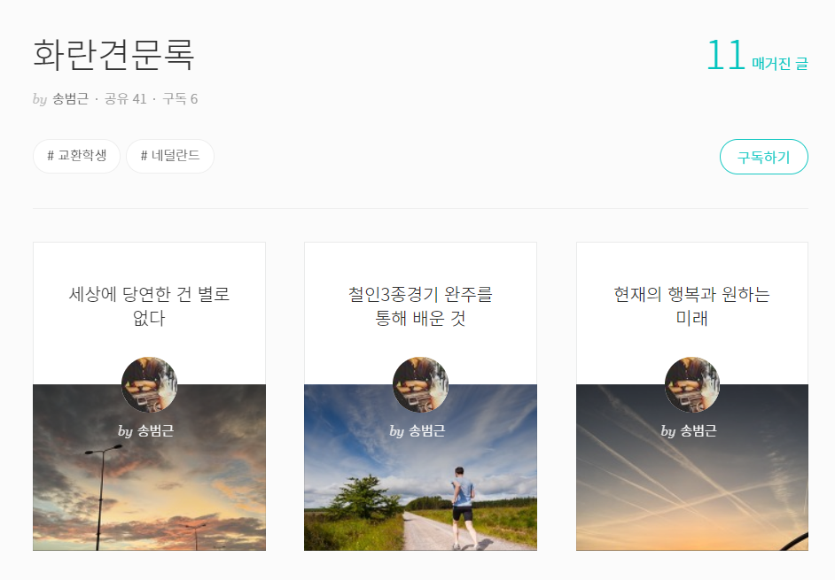
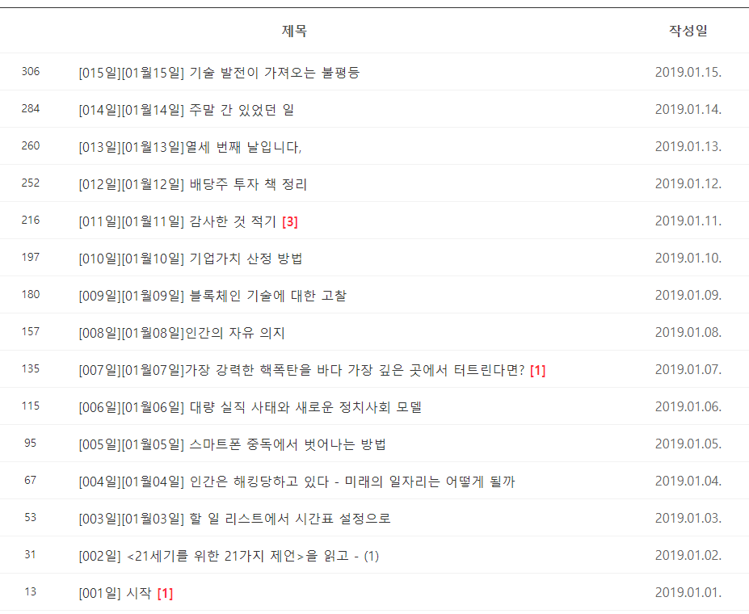
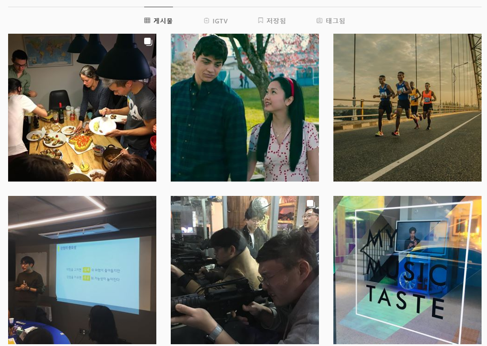

# 나를 보여주는 가장 효과적인 방법

2016년. 스타트업에서 일하고 있을 때였다. 새로 입사한 개발자가 한 명 있었다. 그 분은 원격 근무인데다, 나와 다른 부서라 얘기도 나눠본 적이 없었다. 그런데 그 분이 개발을 하면서 느낀 것, 공부한 것들을 사내 위키에 글로 정리하셨다. 나는 글을 읽으면서 그 사람에 대해 많은 걸 알 수 있었다. 얼굴 한번 본적이 없지만, 이 사람의 기질, 가치관, 태도가 느껴졌다. 좋은 사람이구나 하는 인상을 받았다.

그 때 깨달았다. 글이야말로 '나'를 보여주는 가장 단순하면서 효과적인 방법이다. 그 때부터 나도 글쓰기와 블로그를 해야겠다는 다짐을 했다. 평소 내 컴퓨터에 끄적이는 단상들은 있었다. 하지만 정리해서 꺼내놓은 적은 없었다. 그 때 나는 내 가치를 뭘로 증명해야할까 항상 고민하던 참이었다. 그 고민의 답을 블로그에서 찾았던 셈이다.


# 글쓰는 습관이 필요하다

몇 달 뒤, 나는 네덜란드에 교환학생을 갔다. 1학기가 끝나고 겨울방학 시즌이었다. 3주 정도의 완전한 여유 시간이 생겼다. 미뤄왔던 글쓰기를 시작할 때였다. 브런치에 '화란견문록'을 올리기 시작했다. 네덜란드에서 살면서 보고 느낀 것들을 정리한 글이었다. 

처음 브런치 업로드 계획은 1주일에 2개였다. 지켜야하는 마감이 없으니 계속 미루게 됐다. 그러다 1주일에 1개가 되고, 1달에 1개가 되었다. 11개의 글을 쓰는데 8개월이 걸렸다.

이 경험으로 중요한 교훈을 배웠다. 이 때 중요한 걸 하나 배웠다. '시간 날 때 쓰자'는 '안 쓴다'는 말과 같다. 단순히 쓰자가 아니라 꾸준히 쓰는 '습관'을 만들어야 했다.



# 100일 글쓰기 프로젝트

한국에 돌아왔다. 엄마와 이런 고민을 얘기했다. 엄마가 '숭례문 학당'이라는 곳에서 하는 '100일 글쓰기' 프로그램을 추천했다. 

방법은 심플하다. 20명 정도가 소정의 참가비를 내고 모인다. 비공개 네이버 카페에 하루 하나씩 글을 쓴다. 코치는 발제문을 올려주고, 진도를 체크한다. 글은 아무거나 써도 상관없다. 최소 400자 이상 쓰는 걸 권장할 뿐이다.

곰사람 프로젝트라고도 했다. 곰이 100일 동안 마늘 먹고 사람되었다는 이야기가 있다. 우리도 그렇게 꾸준히 써보자는 뜻이었다.

글쓰기 습관을 고민하던 나에게 좋은 프로그램 같았다. 혼자서 하면 지키기 어려우니까. 곧바로 등록했다. 결과는? 완주했다. 100일 동안 한번도 안 빠지고 글을 올렸다. 

이 프로젝트로 나는 글쓰기가 좀 더 쉬워졌다. 브런치에도 더 자주 글을 올릴 수 있었다. 안 쓴다고 벌주는 것도 아니다. 하지만 매일 쓰겠다는 약속을 하고, 누군가 체크하는 것만으로도 큰 도움이 되었다.

###### 실제 카페에 썼던 글 리스트


```
[100일 동안 매일 글을 쓰면서 달라진 6가지](https://brunch.co.kr/@bumgeunsong/40)
```


# 30일 블로그 글쓰기

그 뒤 한 동안 쉬었다. 17년 하반기-2018년 상반기에는 정말 많은 일이 있었다. 2018년 11월이 되었다. 그동안 너무 글쓰기를 안 했다는 생각이 들었다. 다시 한번 숭례문학당 프로그램을 신청했다.

이번엔 비공개 글쓰기가 아니었다. 각자 자기 블로그에 쓰는 게 과제였다. 100일 글쓰기에서 비공개로 한번 해봤으니, 조금 더 난이도를 올리고 싶어서 골랐다. 30일로 기간은 더 짧았다.

공개적인 글은 더 쓰기 어려웠다. 매일 매일 글을 올리려면, 그럴듯한 게 전혀 안 떠올라도 써야 한다.  예를 들어 글을 아직 못 썼는데 밤 11시가 된다. 1시간 내에 써야 한다. 정말 바보같은 글밖에 안 떠오른다. 비공개 글쓰기라면, '아 오늘은 쓸게 없다'라도 끄적거릴 수 있다. 하지만 블로그는 불특정 다수의 사람들이 본다. 아무거나 쓰기가 쉽지 않았다. 최선을 다했지만, 몇 번 마감을 놓쳤다.

그러나 결과적으로 안 쓰는 것보다는 훨씬 나았다. 당시 회사를 운영하면서 정말 바빴다. 많은 생각들이 내 무의식 안에만 쌓여가고 있었다. 그 생각들을 끄집어내고 자극할 수 있었다. 한 동안 잠잠했던 브런치에 다시 시동을 거는 느낌이기도 했다.


# 365일 매일 글쓰기

2019년 새해 목표를 세울 때였다. 2019년에 하고 싶은 것을 생각해봤다. '매일 글쓰기'가 가장 먼저 떠올랐다. 힘든 건 알고 있었다. 그래도 항상 결과가 뿌듯했다. 다시 도전하고 싶었다.

매일 글쓰기가 어느 정도 몸에 익어 있었다. 운동도 처음에는 힘들다. 하지만 몸에 익고 나면 달라진다. 오히려 안 하면 몸이 찌뿌둥하다. 글쓰기도 그런 느낌이었다. 생각은 많이 한다. 배출구가 없으니까 머릿속에 쌓인다. 마음 한 구석에 신경만 차지하고 있는 답답함.

할 수 있을까 두렵기도 했다. 이번에는 기간이 늘어났다. 무려 1년짜리. 365일. 이젠 학생도 아니고, 사업을 하면서 항상 시간에 쫓기고 있는데 할 수 있을까? 하지만 할까 말까 할 때는 하랬다. 실패해도 남는 게 있을 거라는 마음으로 시작했다.

결과는? 딱 300개의 글을 썼다. 완주는 아니었다. 중간에 힘든 고비가 있었다. 60개 정도를 채우지 못해 아쉽다. 하지만 300개만 해도 상당한 성과였다. 이제 진짜로 글쓰기 습관이 몸에 배었다. 

또 2019년엔 중요한 결정을 내려야 할 때가 많았다. 나를 돌아보는 데 매일 글쓰기가 도움이 많이 되었다. 하길 잘 했다고 생각한다.

###### 1년 글쓰기 리스트




# 인스타 #1일1글 프로젝트

2020년에 새 목표를 세웠다. 기간을 늘려봤으므로, 이젠 난이도 향상이다. 공개범위를 늘리고 싶은 욕심이 생겼다. 브런치, 페이스북도 고려했지만 길이나 너무 많은 페친이 부담스러웠다. 그래서 인스타를 시작했다. 인스타는 비공개 계정이라 마음이 편했다.  

인스타의 또 한 가지 장점이 있다. 반드시 사진을 올려야 한다. 그 동안 글을 많이 쓰면서 깨달은 게 있다. 좋은 글은 말하지 않고 보여준다. 보여주는 글을 쓰려면 묘사력과 스토리텔링이 좋아야 한다. 구체적이고 생생해야 한다. 나는 논리적이고, 개념적인 글로 빠지는 경향이 있다. 그런데 사진을 하나 정하고, 거기에 대해서 쓰면 보여주는 글쓰기가 쉬워진다. 

2020년 1월부터 인스타 #1일1글 프로젝트를 시작했다. 동시에 여전히 나 혼자만 보는 글쓰기도 하고 있다. 프리라이팅이라고 해서 아무 제약이 없는 자유로운 글쓰기다. 아무런 제약 없이 내 생각을 길어올리는 베이스캠프는 여전히 필요하기 때문이다.

###### 인스타 1일1글 중




# 매일 글쓰기를 하고 생긴 변화

여기까지가 약 3년간 내가 해온 매일 글쓰기 경험이다. 매일 글쓰기의 좋은 점은 참 많다. 딱 2개만 정리해보도록 하자.

 

### 1. 글쓰는 습관이 생긴다

 많은 사람들이 글을 잘 쓰고 싶어한다. SNS에서 터지는 글을 보고 부러워한다. 나도 파워블로거가 되고 싶다고 생각한다. 글을 차곡차곡 쌓아서 책 출간하기를 꿈꾼다.

하지만 우리가 부러워하는 사람들도 사실은 수없이 많은 쓰레기 글을 쓴 끝에, 그런 좋은 글을 써낸다. 이 사실을 모르면 글쓰기를 시작하지 못한다. 막상 내가 쓴 글은 너무 수준이 낮아서, 도저히 내가 원하는 수준에 갈 수 없을 거라는 절망감이 들기 때문이다. 

블로그에 첫 글을 썼다고 생각해보자. 내가 생각해도 별로 좋은 글 같지도 않다. 그걸 보고 100만명이 보는 파워블로그를 상상할 수 있을까? 안 될거라는 생각이 먼저 들기 마련이다.

이 상황을 극복하는 법? 바로 **습관**이다. 일단은 아무것도 아닌 것부터 시작해야 한다. 나만 혹은 소수의 사람만 보는 글이라도 매일매일 써보자. 글을 많이 쓰려면 꾸준히 써야하고, 꾸준히 쓰려면 습관이 필요하다. 


### 2. 글감이 계속 생긴다

보통 이런 착각을 한다. 평소 멋진 아이디어가 머릿속에 쌓이고, 글쓰기는 그것을 문자로 잘 옮기고 다듬는 일이라고. 내가 경험한 바로는 아니다. 써보기 전에는 내가 무슨 말을 하고 싶은지 잘 모르는 경우가 더 많다. 행복해서 웃는 게 아니라 웃어야 행복하다는 말도 있지 않나. 마찬가지로 글도 하고 싶은 말이 명확해야 쓰는 게 아니라 쓰면서 하고 싶은 말이 명확해진다. 

매일 글쓰기는 머릿속에서 하고 싶은 말을 계속 캐내는 행위다. 캐내보면 그냥 돌멩이일수도 있다. 하지만 매일매일 뭐라도 캐서 쌓는다. 그러다보면 보석이 될만한 돌이 하나쯤 보인다. 그걸 골라서 다듬는다. 남들이 읽어도 좋을만한 글로 거듭난다.

100일 글쓰기를 하면, 다른 글을 쓸 시간이 줄어든다고 생각할 수 있다. 하지만 내가 100일 글쓰기를 처음 했을 때, 오히려 평소보다 훨씬 더 글을 자주 올렸다. 다듬어지지 않은 생각들을 계속 캐냈기 떄문이다. 덕분에 브런치에 써도 좋겠다는 글감도 더 자주 볼 수 있었다.


# 매일 글쓰기를 하고 싶다면

글쓰기로 자신의 가치를 높이고 싶다. 글을 잘 쓰고 싶다. 콘텐츠 자본을 쌓고 싶다. 이런 생각을 가지고 있는가? 매일 글쓰기부터 시작하자. 강력 추천한다. 시작하는 사람들에게 도움이 될만한 말을 몇 가지 정리해봤다.


### 1. **처음 쓸 때는 절대 비판하지 말자.**

수많은 글쓰기 책에 나오는 조언이다. 그 중에서도 가장 와닿았던 책. 피터 엘보의 <힘있는 글쓰기> 거기엔 이런 말이 나온다.

>글쓰기에는, 너무 달라서 충돌할 때가 많은 두 가지 기술이 필요하다. 창조하기와 비판하기다.

> 창조와 비판의 과정을 분리하라. 먼저 비판 없이 자유롭게, 좋은지 나쁜지 걱정하지 말고 생각과 글을 최대한 많이 생산한다. 그런 다음 비판적인 마음가짐으로 쓴 것을 퇴고한다. 좋은 부분을 살리고, 좋지 않은 부분은 버린다.

> 독창적이고 창의적으로 글을 쓰지 못하게 가로막는 벽은 '바보처럼 보이면 어쩌나'하는 두려움이다. 생각나는 대로 써나가다보면 어떤 부분은 정말로 멍청한 느낌을 줄 수도 있다. 하지만 후반부에서 비판적으로 검토하리라는 것을 알면 창의력을 더 발휘하게 된다.
>
> -<힘있는 글쓰기>, 피터 엘보

내가 매일 글쓰기를 하면서 얻은, 단 하나 가장 중요한 깨달음이 있다. **글쓰기가 어려운 이유는 두려움이다.** 쓰는 행위 자체는 힘든 게 아니다. '틀리면 어쩌지' '바보같은 글이야' 같은 생각들이 괴로운 거다. 

우리 마음 속에는 완벽주의와 회의주의로 무장한 검열관이 한 명 살고 있다. 내가 무언가 쓰려고 했을 떄 '그건 아니지'하고 끊임없이 태클을 건다.

글을 꾸준하게 쓰려면 바로 이 검열관을 무시하는 법을 배워야 한다. 창조와 비판을 반드시 분리해야 한다. 고치는 건 얼마든지 뒤에 고칠 수 있다. 지금은 일단 그냥 쓴다. 멈추지 말고. 

줄리아 카메론의 <아티스트 웨이>란 책이 있다. 여기 나오는 '모닝 페이지'를 시도하는 것도 좋다.


### 2. 플랫폼, 툴에 시간 쓰지 말자.

많은 사람들이 글쓰기를 시작할 때 주의를 많이 빼앗기는 것. 바로 어떤 플랫폼에 쓸지, 어떤 도구를 사용해서 쓸지다. 나도 많이 그랬다. 브런치를 할까 티스토리를 할까? 에버노트를 쓸까 노션을 쓸까? 등등... 또 블로그를 한다면 카테고리를 예쁘게 나눠, 시리즈로 착착 쓰고 싶은 욕망이 조금씩은 들게 마련이다.

운동 시작하면 장비부터 쇼핑하는 거랑 똑같은 심리다. 하지만 장비빨에 너무 신경쓰면 막상 글 쓸 시간을 뺏긴다. 툴과 플랫폼 별로 안 중요하다. 매일 글쓰기의 목표는 습관이다. 너무 많이 고민하지 말자. 경험상 '에라 모르겠다'하고 쓰기 시작했을 때가 가장 성과가 좋았다.


### 3. 시간을 정해놓고 쓰자.

내가 처음 매일 글쓰기를 했을 땐 시간을 정하진 않았다. 그러다보니 글쓰기를 항상 마감인 자정 근처에 와서야 허겁지겁 올렸다. 파킨슨의 법칙이다. 인간은 반드시 마감 시간까지 미루게 되어있다. 

12시가 다 되어 헐레벌떡 쓰면, 마음이 급해서 글쓰기를 즐길 여유가 없다. 밤이라 피곤해서 머리도 잘 안돌아간다. 가장 치명적인 것. 마감을 넘겨버리기 쉽다. 그만두는 핑계가 된다.

나는 글쓰기 시간을 아예 정해버렸다. 절대 방해받지 않는 글쓰기 시간. 아침 시간이 가장 좋은 것 같다. 회사에 조금 일찍 간다. 사무실 도착해서 일하기 전 30분 동안 글을 쓴다. 타이머를 맞춰놓는다. 뭐가 됐든 쓴다.

시간을 정해놓으면 습관도 더 빨리 생긴다. 글쓰기도 잘 밀리지 않는다. 만약 아침에 정말 못 써도, 저녁에 만회할 수 있다.


### 4. 공개도를 천천히 올리자.

글쓰기의 가장 큰 적이 뭐라고? **바보같은 글을 쓴다는 두려움**이다. 이 두려움은 많은 사람한테 보여주는 글을 쓸 수록 커진다. 

그러므로 매일 글쓰기를 시작할 땐 소규모 비공개 그룹에 쓰는 걸 추천한다. 친구들과 카톡방을 만들어도 좋고, 나처럼 교육 프로그램에 등록해도 좋다. 자신의 내밀한 이야기를 편하게 써낼 수 있는 독자들로 하자. 그렇지 않으면 머릿속 검열관을 무시하기가 쉽지 않다. 

목표를 어느 정도 달성하면 점점 공개도를 올려보자. 물론 자유롭게 쓰기가 우선이다. 하지만 항상 편한 곳에서만 글을 쓰면 또 실력이 늘지 않는다. 공개적인 글은 퇴고 단계를 연습할 수 있다. 

자유롭게 쓰고 나서, 좋은 부분을 골라내고 다듬는다. 남들에게 읽히려면 어떻게 해야할까 고민하고 시도한다. 이 과정에서 글쓰기 실력이 늘게 된다.


### 5. 사진 하나를 놓고 써보자.

앤 라모트의 <쓰기의 감각>에 나오는 방법이다. (글쓰기를 해본 사람이라면 누구나 재미있게 읽을 책이다. 일독을 권한다.) 앤은 거대한 것에 쓰려면 막히기 쉽다고 말한다. 그러면서 2.5인치 사진을 한 장 놓고, 그 안의 내용에 대해서만 쓰라고 조언해준다. 

>거대한 것이 마음에 떠오를 때가 있다. 유년 시절에 대한 자서전, 이민 경험에 대한 시나리오, 연애 편력 같은 걸 쓰려고 할 수 있다. 하지만 빙하를 기어르려고 노력하는 것과 비슷하다. 발을 들여놓기도 어렵고, 손가락이 모두 발갛게 얼어 터지고 말 것이다.  (...)

> 이 시점에선 무조건 멈춰야 한다. 공포의 언덕이 솟아 오른다. 정글의 북소리가 울린다. 우물물은 말랐다. 나에게 미래는 없다. 그나마 취직이 가능할 때 얼른 직장을 얻어야 하는게 아닌가하고 걱정이 들 때 말이다.

> 몇 분간 앉아서 심호흡하면서 진정한다. 잠시 후 치열 교정을 하기에 너무 나이가 든 것이 아닌지, 지금 당장 걸어야 하는 전화 몇 통을 떠올리고 그게 꼭 필요한 건지 아닌지를 판단하려 애쓰다가, 그 다음에는 화장품 사용법을 배울 것인지에 관해 고민하는 자신을 인식한다. 남자 친구는 어떻게 찾을 것이며, 그러면 내 인생이 행복할 것인지도 고민한다. 그러고는 글쓰기를 시작하기 전에 전화를 해야할 모든 사람에게 생각하고, 책으로 출판되면 어떻게 페이스북에 소개 문구를 써야할지 생각할 것이다. 

> 나는 다시 심호흡을 시도한다. 안정을 취한다. 마침내 내 책상 위에 놓인 작은 사진틀에 주목하게 된다. 나에게 짧은 글 한편을 떠올리게 해줄 사진이다. 

>당신에게 가능한 다정하게 말하라. 자, 지금 우리가 해야 할 일은 오로지 일출의 강변을 묘사하거나, 클럽 수영장에서 수영하는 어린이를 묘사하거나, 남자가 결혼할 여자를 처음 마주친 순간을 묘사한 것뿐이야. 하나씩 하나씩 차근차근 써나가기만 하면 돼. 하지만 여기서 이 짧은 글 한편을 마무리하는 거야, 알았지?

> <쓰기의 감각>, 앤 라모트


# 정리

1. 글을 잘 쓰고 싶다면 습관을 만들어야 한다.
2. 나도 습관을 만들려고 매일 글쓰기를 시작했다. 3년 동안 다양한 형태로 매일 글쓰기를 해오고 있다.
3. 매일 글쓰기는 글쓰기를 지속할 수 있는 체력을 만들고, 나도 모르는 머릿속 글감을 꺼내주었다.
4. 매일 글쓰기를 하고 싶은 사람에겐 다음 5가지를 말해주고 싶다.
   1. 초고를 쓸 때는 절대 비판하지 말자.
   2. 플랫폼, 툴에 시간쓰지 말자.
   3. 시간을 정해놓고 쓰자.
   4. 공개도를 천천히 올리자
   5. 사진 하나를 두고 써보자.


---

글쓴이: 범근

